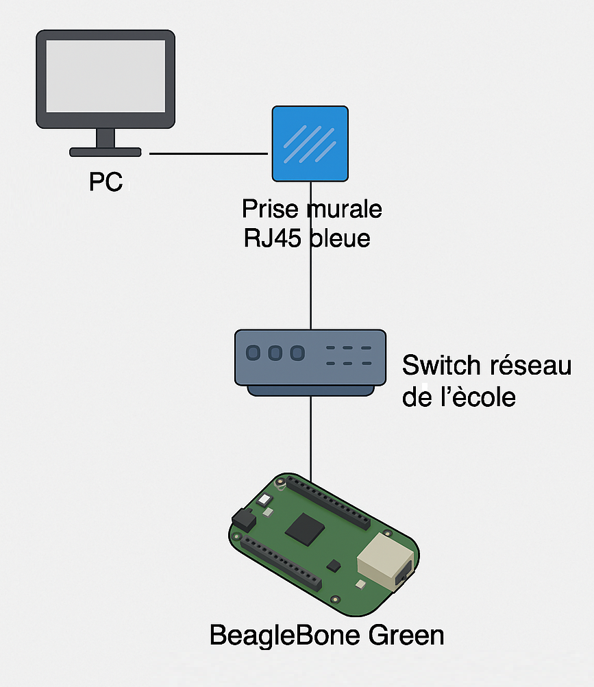

#  EMSY02 – TP3: Linux Embarqué avec BeagleBone Green 
> Benjamin Schafroth et Henri Mott

## But du TP

Ce projet a pour but d’explorer l'utilisation d’un système Linux embarqué sur une BeagleBone Green (BBG).

---

### Q1. Protocole de communication permettant de vous connecter à distance à la BBG ?
SSH (Secure Shell)

### Q2. À quoi correspond ce protocole dans le modèle OSI (numéro et nom de la couche) ?
Couche 7 – Application

### Q3. Le protocole utilisé à la question 1 fait référence à quel autre protocole et port ?
Protocole : TCP  
Port : 22

### Q4. Lors de votre connexion, dans quel répertoire vous trouvez-vous ? quelle(s) commande(s) utilisez-vous (complète) ?
Commande : `pwd`  
Répertoire : `/home/debian`

### Q5. Si vous n’arriviez pas à vous connecter à la BBG, quelle commande, testeriez-vous depuis la machine hôte ?
- `ping <adresse_IP>`
- `telnet <adresse_IP> 22`
- `nmap <adresse_IP>`

### Q6. Sur la BBG, quelles sont les commandes pour connaitre la configuration du réseau Ethernet ?
- `ip a`
- `ip r`
- `ip link`

a. Adresse IP : affichée par `ip a`  
b. Masque de sous-réseau : affiché par `ip a` ou avec `ifconfig`  
c. Adresse réseau : calculable avec `ipcalc`  
d. Passerelle par défaut : `ip r`  
e. MAC adresse : `ip link`

### Q7. Quelles commandes utilisez-vous pour créer ce répertoire et qui a les droits d’écriture dessus ?
```bash
mkdir TP3_BSH_HMT
ls -ld TP3_BSH_HMT
```
### Q8. Vérification et installation d’un logiciel (exemple : `nano`)
#### verification si un logiciel est installé ?

Utilisez la commande suivante pour vérifier si le logiciel `nano` est présent :
```bash
Nano --version
```
#### installation si un logiciel n'est pas installer (exemple : `nano`)
```bash
sudo apt-get update
```
```bash
sudo apt-get install nano
```

#### lecture d'un fichier sans utiliser nano
```bash
cat mon_fichier.txt
```
### Q9. schéma de principe réseau


### EXÉCUTION AUTOMATIQUE

Pour la partie 6, on nous a demandé que notre système soit capable d'envoyer un mail dans un temps désiré.
Également, si la température passe la seulle qui n'est pas acceptable, il nous envoie également un email d'urgence.

](https://github.com/Hayatache/TP3_EMSY_1/blob/main/temperature%20warning%20mail.png)

Pour régler notre email automatique, on exécute la commande "crontab -l". 
le chiffre 15 représente l'intervalle de temps que le code va s'exécuter, le code en.py peut également être changé


Voici un screen qui démontre notre code fonctionnel, est l'écriture des données dans le.svc
)
